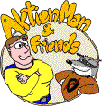
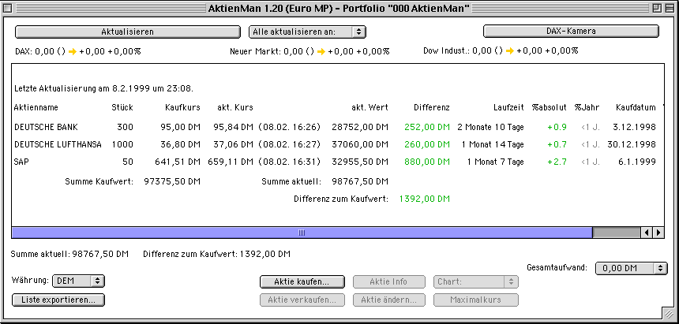
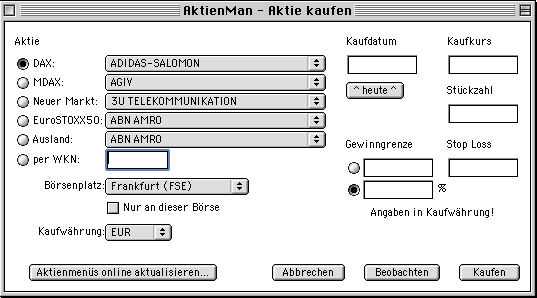
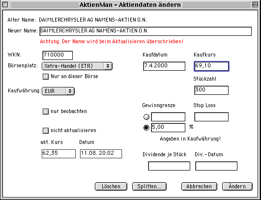
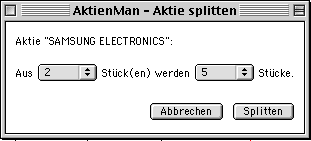
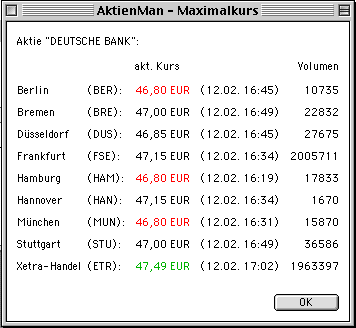
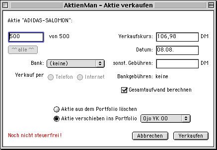
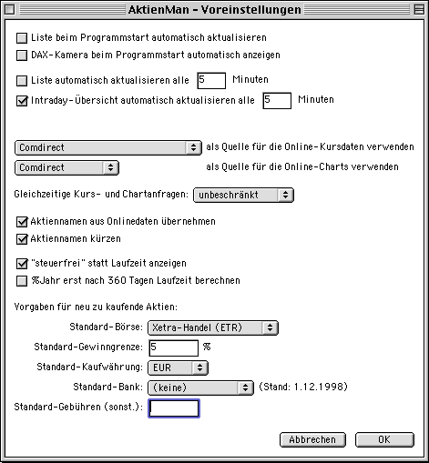
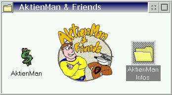

# AktienMan 

At the end of the 1990s the internet and the web were booming. And so were the first online banking sites,
including the possibility to trade stocks online. A friend of mine, Oliver 'Ojo' Joppich, was tired of
having to read stock prices from various banks' web pages and input them into an Excel sheet for his
home-grown portfolio management. So we got into a discussion how an application would look like that
could read all the necessary data from the internet automatically.

Before long, I was writing ["AktienMan"](https://snailshell.de/aktienman/) for Oliver's company
"AktienMan & Friends", and at the end of 1998 we were able to release version 1.00 to the public.
We maintained the software actively for 3 years and more or less active for 3 more years.
AktienMan would make HTTP requests to the banks' public stock price pages, passing suitable request
parameters (crude HTML being our ever-changing "API"). I'm not sure if the banks really liked that
approach, and in fact this might be the reason why we had to stop crawling their web pages. The [last
version](https://snailshell.de/aktienman/Beta/) switched to Yahoo for most stock prices.

AktienMan was written in Java. We provided bundled applications and launch scripts, respectively,
for Classic Mac OS (our main focus), Mac OS X, Windows, Linux and - ta-dah - OS/2.

The company is long gone and sadly Oliver passed away some years ago. But as I started to release the
source code for several of my older software projects, I thought it would be a great idea to add the
AktienMan sources to that list. So here you are.

Some things to consider:

- I wrote this Java code before I knew how to unit test my software.
- Honestly, I don't know any more why I didn't use Java packages. Maybe it was a shortcoming in the IDE,
  maybe I didn't know how to properly use it in that IDE. Eminently suitable for one of the first
  refactorings ;-)
- Speaking of the IDE: AktienMan was built using [Metrowerks](https://en.wikipedia.org/wiki/Metrowerks)
  [CodeWarrior](https://en.wikipedia.org/wiki/CodeWarrior#History). Before Eclipse and all other modern
  IDEs, CodeWarrior's Java tools were first choice on a Mac at that time.
- AktienMan uses Java's oldest (and ugliest) UI library, AWT. No Swing. Which resulted in pretty clumsy
  dialogs on most systems, especially Mac OS. But as we wanted AktienMan to work on Classic Mac OS
  (and MRJ - Macintosh Runtime for Java - could only handle Java 1.1) *and* we did not want to bundle
  the *huge* Swing libraries with the AktienMan distribution (bandwith was pretty low back then), we had to
  stick with the only UI lib that came bundled with Java 1.1 ...
- All but the latest version used binary object serialization for storage. Terrible idea (please don't
  do this any more), but in 1998 it actually was a decision for better performance.
- Documentation is available in German only, sorry. The most up-to-date user guide can be found
  [here](doc/am-kurz.pdf).

I tried to preserve the original files and file attributes. One thing I changed, though, were the
line endings. I replaced the Classic Mac OS line endings (^M, CR, \\r) with the common Unix ones (LF, \\n).
Works way better in Git (and everywhere else). My tool of choice for this task was
[endlines](https://github.com/mdolidon/endlines):

    endlines unix -kf doc/* src/*.java

## Disclaimer

This source code is completely out of date. It is provided as-is without any warranty.

I publish the source files for historical / archaeological reasons only, for informational purposes.
The code is not intended to be used any more, especially not as a template for new code.

That being said - have fun! :-)

Thomas\
@thmuch

## Screenshots

